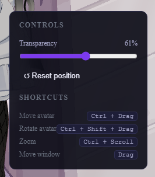
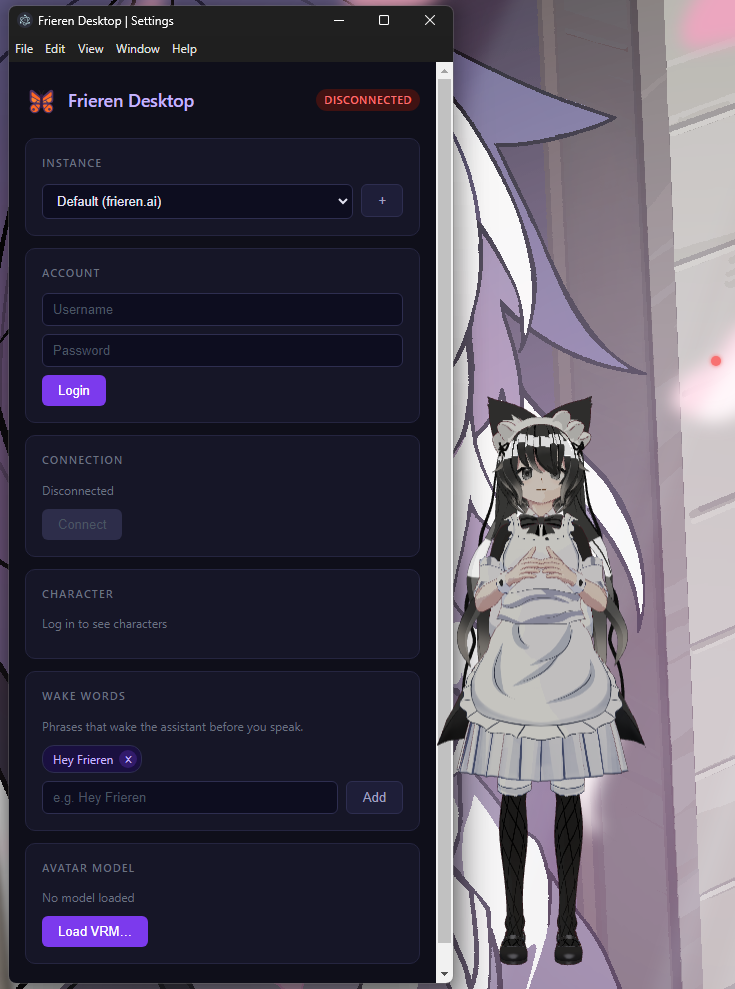

# 🦋 Frieren Desktop
> *"A window into another world."*

Frieren Desktop is a talking, animated 3D companion that lives on your desktop. It's the client-side "face" of the [Frieren AI Ecosystem](https://github.com/Frierenclaw): it renders a VRM avatar, listens to your microphone, and speaks back to you with real-time lip-sync.

No coding, no setup beyond installing it. Download, run, connect, talk.

  

  
  

## What it does

* **Lives on your desktop.** A transparent, always-on-top window with a fully rigged 3D avatar, animated idle breathing, blinking, and sway, so it feels alive even when nobody's talking to it.
* **Real lip-sync.** The avatar's mouth moves in sync with what it's actually saying, not just a generic bobbing animation.
* **Stays out of your way.** Click-through by default, only interactive when your cursor is actually over the avatar; drag it anywhere, resize it, or shrink it into passive mode.

## Download & Install

Grab the latest version from the **[Releases page](https://github.com/Frierenclaw/frieren-desktop/releases)**. Pick the file for your system:

| OS | File to download | How to run it |
|---|---|---|
| **Windows** | the `.exe` installer | Double-click it, follow the installer, done. |
| **macOS** | the `.dmg` | Open it, drag Frieren Desktop into Applications. |
| **Linux** | the `.AppImage` | Make it executable (`chmod +x Frieren-Desktop*.AppImage`), then double-click or run it from a terminal. |

## First launch

1. Open the app, you should see the avatar appear on your desktop.
2. Right-click the avatar → **⚙ Settings**.
3. Under **Instance**, either use the server that comes pre-configured, or add your own if you're connecting to a different Fern server.
4. **Log in** with your account.
5. Pick a **Character**.
6. (Optional but recommended) add a **Wake Word**, like "Hey Frieren", under **Wake Words**, the assistant won't start listening for you without at least one.
7. Hit **Connect**. You should see the status dot turn green.

## Controls

| Action | Shortcut |
|---|---|
| Move avatar | `Ctrl + Drag` |
| Rotate avatar | `Ctrl + Shift + Drag` |
| Resize avatar window | `Ctrl + Scroll` |
| Digital camera zoom | `Ctrl + Shift + Scroll` |
| Open right-click menu | Right-click on avatar |
| Reset position/size | Right-click menu → Controls → "Reset position" |
| Passive mode (click-through everywhere) | Right-click menu → "Enable passive mode" |
| Quit | Right-click menu → "✖ Quit" |

## Want to build it from source, or contribute?

This README is for people who just want to run the app. If you're a developer and want to build it yourself, hack on it, or contribute, see **[CONTRIBUTING.md](./CONTRIBUTING.md)**.

## Help & Feedback

Found a bug or something not working right? Open an [issue](https://github.com/Frierenclaw/frieren-desktop/issues) or join the official [Discord](https://discord.gg/D3fzxAA3tF) server and report your bug on #bugs, the more detail the better (what OS, what you were doing, what happened instead).

---

Part of the [Frieren AI Ecosystem](https://github.com/Frierenclaw).